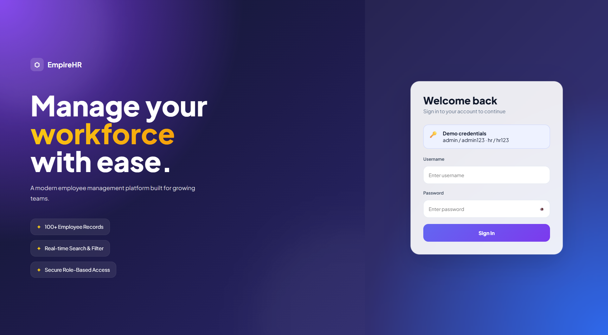
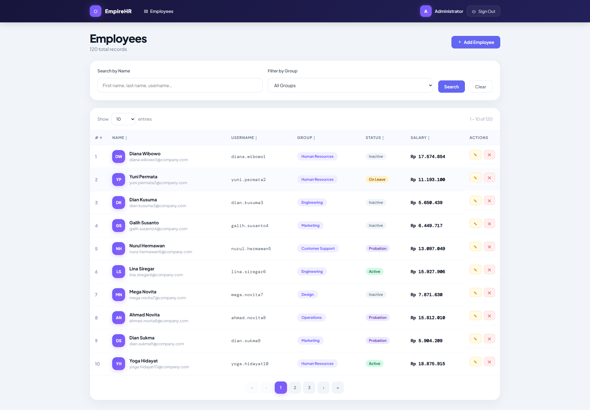
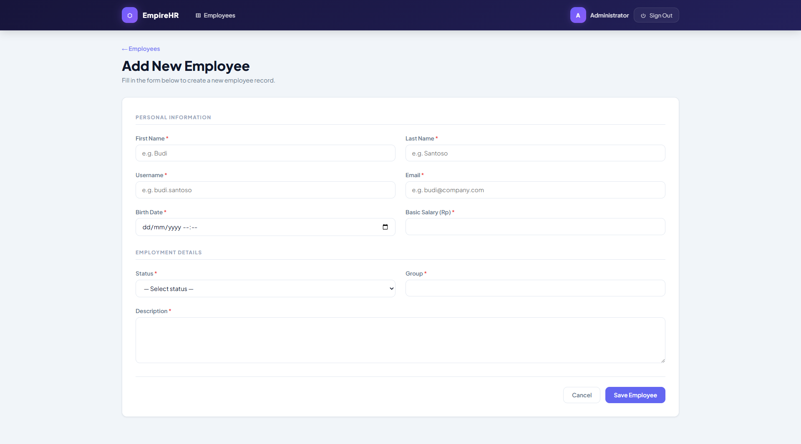
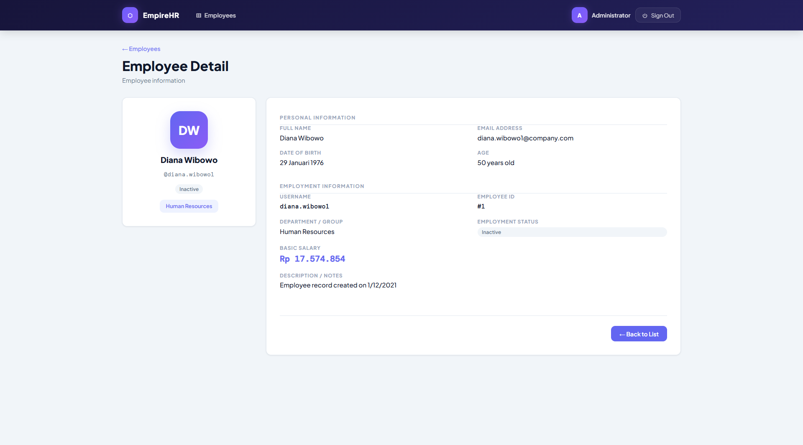
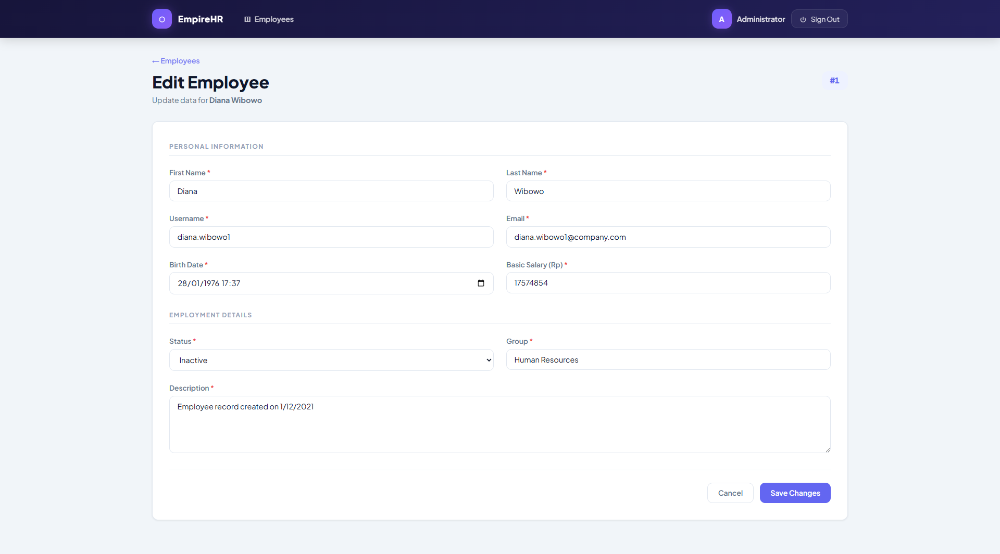

# Employee Management

Mini project Employee Management yang dibuat menggunakan Angular 20.

## Features

### Login Page

* Login menggunakan username dan password.
* Validasi login menggunakan data dummy (hardcoded).
* Proteksi halaman menggunakan Auth Guard.



### Employee List Page

* Menampilkan lebih dari 100 data employee dummy.
* Searching berdasarkan:

  * Name
  * Group
* Sorting data pada tabel.
* Pagination.
* Pengaturan jumlah data per halaman.
* Add Employee.
* Edit Employee.
* Delete Employee dengan notifikasi.



### Add Employee Page

* Seluruh field wajib diisi.
* Validasi format email.
* Validasi salary hanya menerima angka.
* Birth Date tidak boleh melebihi tanggal hari ini.
* Group menggunakan dropdown dengan data dummy.



### Employee Detail Page

* Menampilkan detail employee.
* Format salary menggunakan format Rupiah.
* Tombol kembali ke Employee List.
* State pencarian dan pagination tetap dipertahankan saat kembali ke halaman list.





## Technology Stack

* Angular 20
* TypeScript
* SCSS
* Angular Router
* Reactive Forms

## Environment

Pastikan environment berikut telah terinstall:

* Node.js 22.x atau lebih baru
* npm 10.x atau lebih baru
* Angular CLI 20.x

Cek versi:

```bash
node -v
npm -v
ng version
```

## Installation

Clone repository:

```bash
git clone <repository-url>
```

Masuk ke folder project:

```bash
cd employee-management
```

Install dependencies:

```bash
npm install
```

---

## Running Application

Jalankan aplikasi:

```bash
ng serve
```

Buka browser:

```text
http://localhost:4200
```

## Build Application

```bash
ng build
```

Hasil build akan tersedia pada folder:

```text
dist/
```

## Dummy Login Account

| Username | Password |
| -------- | -------- |
| admin    | admin123 |
| hr       | hr123    |

## Project Structure

```text
src/
├── components/
│   ├── pages/
│   │   ├── login/
│   │   ├── employee/
│   │   │   ├── employeelist/
│   │   │   └── employeedetail/
├── guards/
├── services/
├── models/
├── app.routes.ts
```

## Notes

* Data employee menggunakan dummy data.
* Data disimpan pada memory (tidak menggunakan backend/API).

## Live Demo

```
https://employee-management-seven-hazel.vercel.app/login
```